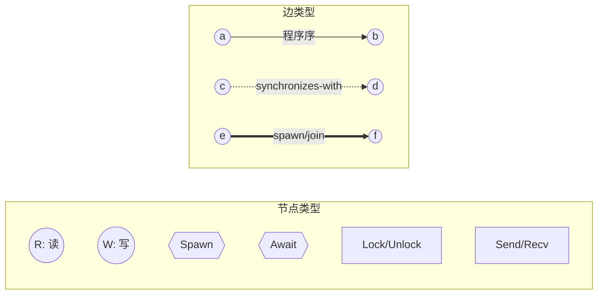
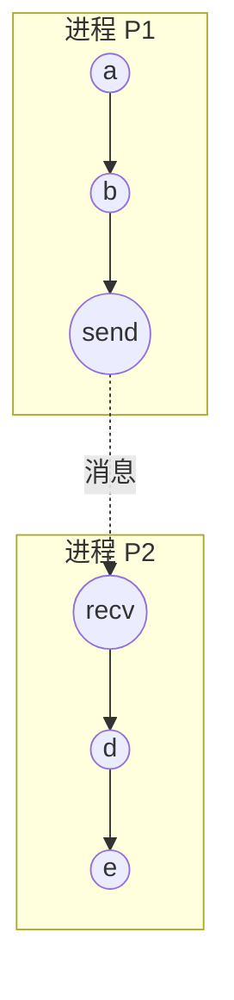
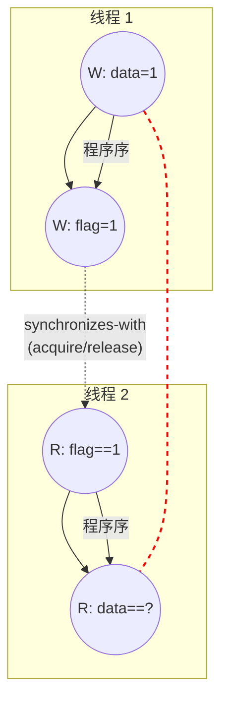

1978 年，Leslie Lamport 在 *Communications of the ACM* 上发表了一篇只有八页的论文——[*Time, Clocks, and the Ordering of Events in a Distributed System*](https://lamport.azurewebsites.net/pubs/time-clocks.PDF)。这篇论文后来获得了 PODC 最具影响力论文奖（2000 年）和 ACM SIGOPS 名人堂奖（2007 年）。

论文的核心贡献是一个看似简单的概念：**happens-before**（先发生于）。并发执行可以被建模为事件图，其中节点是操作，边是因果关系。本文的核心观点是：并发往往存在于那些“缺失的边”之中，而通过显式地补齐这些边，我们可以更清晰地理解数据竞争与结构化并发。



<!-- more -->

## 事件图与偏序 (Event Graph & Partial Order)

当我们谈论并发程序的执行时，直觉上往往会诉诸“物理时间”：操作 A 是不是在操作 B 之前发生的？然而，在分布式系统和多核处理器中，全局一致的物理时间（Physical Time）既难以测量，也并非逻辑上的必需品。Lamport 在其 1978 年的经典论文中指出：

> "A distributed system consists of a collection of distinct processes which are spatially separated, and which communicate with one another by exchanging messages... A system is distributed if the message transmission delay is not negligible compared to the time between events in a single process." (Lamport 1978, p.558)

这意味着，分布式系统（甚至可以推广到单机内的多核执行）的本质在于通信延迟的存在，使得我们无法通过单一的全局时钟来判定所有事件的顺序。在分布式系统中，"时间"是没有全局意义的。每台机器有自己的时钟，这些时钟不可能完美同步。

为此，我们需要将执行过程建模为一个**事件图（Event Graph）**。每一个执行步骤（如读写内存、发送消息、启动线程）都被视为一个节点。节点之间的连线代表了因果关联。这种由节点和因果边构成的图是一个有向无环图（DAG）。通过这种建模，并发程序的执行逻辑不再是一条线性的时间轴，而是一张复杂的网。在这种视角下，所谓的“顺序”不再是绝对的，而是一种偏序关系（Partial Order），即“因果先行”。


## Happens-Before 的三个条件

为了在缺乏全局时钟的系统中建立顺序感，Lamport 定义了 **Happens-Before** 关系（记作 $\to$）。这是在事件集合上定义的一种偏序关系，它不要求任意两个事件都有确定的先后顺序，但保证了因果链条的严谨性。根据 Lamport (1978, p.559) 的定义，这个关系是满足以下三个条件的最小关系：

> "Definition. The relation '--->' on the set of events of a system is the smallest relation satisfying the following three conditions: (1) If a and b are events in the same process, and a comes before b, then a → b. (2) If a is the sending of a message by one process and b is the receipt of the same message by another process, then a → b. (3) If a → b and b → c then a ---> c."

我们可以将这三个条件直观地理解为：

1.  **程序序（C1, Program Order）**：在同一个进程（或线程）内，代码执行的先后顺序自然构成了 Happens-Before 关系。

2.  **同步序（C2, Synchronization Order）**：如果进程 P1 发送了一条消息，而 P2 接收了这条消息，那么“发送”这一动作一定 Happens-Before “接收”。在内存模型中，这对应于 release 操作与 acquire 操作之间的同步。

3.  **传递性（Transitivity）**：如果 $a \to b$ 且 $b \to c$，那么 $a \to c$。

基于这个定义，我们可以给**并发（Concurrency）**下一个非常精确的定义：如果两个事件 $a$ 和 $b$ 之间既没有 $a \to b$ 也不存在 $b \to a$（即 $a \nrightarrow b$ 且 $b \nrightarrow a$），那么我们就称 $a$ 和 $b$ 是并发的（记作 $a \parallel b$）。这意味着它们在因果图中没有路径相连，处于不同的分支上。值得注意的是，**并发并不意味着“同时发生”**，而是指它们在逻辑顺序上是互不干扰的。并发的本质，往往就隐藏在那些“缺失的边”中。

以经典的 Message Passing (MP) 模型为例，如下方的 Mermaid 图 (D2) 所示。如果缺失了从 P1 的 `send` 到 P2 的 `recv` 这条虚线边，那么 P1 的数据准备（a, b）与 P2 的数据使用（d, e）之间就没有任何 Happens-Before 路径。这种边的缺失直接导致了并发访问冲突，即我们常说的数据竞争（Data Race）。



## 时钟条件与逻辑时钟

既然物理时间不可靠，我们能否通过某种逻辑上的“计数器”来捕捉这种 Happens-Before 关系？这就是 Lamport 提出的逻辑时钟（Logical Clock）。每个进程维护一个本地计数器，并在事件发生或接收消息时进行更新。由此产生的时间戳需要满足所谓的**时钟条件（Clock Condition）**：

> "Clock Condition. For any events a, b: if a---> b then C(a) < C(b)." (Lamport 1978, p.560)

这意味着，如果两个事件之间存在因果关系，那么它们的时间戳一定反映了这种顺序。然而，时钟条件的一个关键性质是它的**不可逆性**：如果 $C(a) < C(b)$，我们并不能推导出 $a \to b$。这正是逻辑时钟的局限性所在。两个完全没有因果关系的并发事件，也可能因为本地计数器的更新步调，而在数值上呈现出某种大小关系。

例如，进程 P1 在本地执行了一万个事件（都是纯计算，没有通信），其时间戳已经累加到 10000。进程 P2 刚启动，时间戳为 1。P2 的某个事件时间戳为 1，P1 的某个事件时间戳为 5000，但这两个事件之间可能毫无因果关系。

### 实现算法 (IR1/IR2)

Lamport 给出了一套简单的规则来维护这个计数器：

- **IR1（进程内推进）**：每个事件发生时，计数器自增：`local_clock += 1`。
- **IR2（消息接收时同步）**：接收到带时间戳 $T_m$ 的消息时：`local_clock = max(local_clock, Tm) + 1`。

这个 `max + 1` 保证了接收事件的时间戳严格大于发送事件的时间戳，从而满足 C2。

### 全序扩展与外部因果性

偏序可以被扩展为全序：只需用进程 ID 打破时间戳相同时的平局。`a ⇒ b` iff $C(a) < C(b)$，或 $C(a) = C(b)$ 且 $pid(a) < pid(b)$。Lamport 在论文中说这个全序是 **"somewhat arbitrary"**（有些随意的），因为它仅仅是一个约定。

另一个限制是**外部因果性**：如果一个人打电话告诉另一台机器上的操作员"我刚看到事件 a 发生了"，这条因果链无法被系统捕获。这是形式模型和物理现实之间永恒的张力。

这种“时间戳不代表因果”的现象，再次提醒我们 Happens-Before 是关于逻辑拓扑的，而非绝对时间的。虽然向量时钟（Vector Clocks）可以通过维护更多的元数据来解决逆命题问题（即实现 $C(a) < C(b) \iff a \to b$），但这通常会带来额外的内存开销 [^1]。


## 从硬件到语言：消息传递 (Hardware to Language: Message Passing)

在 Lamport 的原始论文中，消息传递是建立跨进程因果关系的唯一手段。但这和现代多核处理器是**同构的**：每个核心相当于一个进程，每次同步操作相当于消息传递。

### 硬件的重排序与 TSO

现代 CPU 为了性能，会对内存操作进行重排序（如 Store Buffer 的延迟刷新或乱序执行）。x86 的内存模型叫做 **TSO（Total Store Order）**，可以理解为：所有处理器共享同一块内存，但每个处理器有一个私有的写队列（FIFO）。

在这种模型下，即使两个线程在同一个物理内存上操作，缺失了显式同步也可能打破直觉。例如，线程 2 可能会先观察到 `flag` 的更新，却读到 `data` 的旧值。这在事件图的角度来看，就是因为 `W(data)` 到 `R(data)` 之间缺失了一条关键的因果边。



### C++ 内存模型：补齐缺失的边

现代编程语言（如 C++）的内存模型，本质上是在硬件之上提供的一层抽象。在 C++ 中，这种跨线程的边通常是由 **synchronizes-with**（同步关系）来构建的。当我们使用 `std::atomic` 的 Acquire/Release 语义时，一个线程的 Release Store 同步于另一个线程对同一变量的 Acquire Load。

```cpp
#include <atomic>
#include <thread>
#include <cassert>

std::atomic<int> data{0};
std::atomic<int> flag{0};

// 线程 1: 生产者 (Producer)
void producer() {
    // 1. sequenced-before: data 写入先于 flag 写入
    data.store(42, std::memory_order_relaxed);
    
    // 2. Release store: 建立同步边的起点
    flag.store(1, std::memory_order_release);  // ← release
}

// 线程 2: 消费者 (Consumer)
void consumer() {
    // 3. Acquire load: 建立同步边的终点
    // 当读取到 1 时，与 producer 的 store 构成 synchronizes-with 关系
    while (flag.load(std::memory_order_acquire) != 1) {}  // ← acquire
    
    // 4. 结合传递性，此时 data.store 一定 happens-before 这里的 read
    assert(data.load(std::memory_order_relaxed) == 42); // 绝对安全
}
```

在 C++ 中，如果不通过这种方式显式建立 Happens-Before 关系而产生并发读写，就会构成 **Data Race**，这在标准中被定义为未定义行为（Undefined Behavior）。

## JMM 中的 happens-before

Java 5 引入的内存模型（JSR-133）也直接使用了 "happens-before" 术语。我们可以用 C1/C2 的语言来理解 JMM 的规则：

- **程序顺序规则 (C1)**：同一线程中，前面的操作 happens-before 后面的操作。
- **同步规则 (C2)**：
    - **监视器锁规则**：`unlock(m)` happens-before 后续的 `lock(m)`。
    - **volatile 变量规则**：对 `volatile` 变量的写 happens-before 后续对同一变量的读。
- **生命周期规则**：
    - **线程启动规则**：`Thread.start()` happens-before 新线程的任何操作。
    - **线程终止规则**：线程的所有操作 happens-before `Thread.join()` 的返回。

## 结构化并发：让边成为结构 (Structured Concurrency)

如果说 MP 模型揭示了由于缺失同步边（Synchronization Edge）导致的读写冲突，那么结构化并发解决的则是生命周期边（Lifetime Edge）的缺失。

传统的并发（如 `detach` 或 `Future.then`）会让 happens-before 关系与词法作用域脱节，导致悬垂引用（Dangling Reference）。结构化并发的核心约束是：**子任务的操作必须在其父任务的作用域退出之前全部完成**。

### C++ 协程中的结构化

在 C++ 协程中，逻辑上建立了一条从子任务完成到父任务继续执行的 Happens-Before 边。

```cpp
// ✅ 伪代码 — 结构化并发修复
task<void> parent() {
    std::string data = "hello";
    co_await with_task_group([&](task_group& g) -> task<void> {
        g.spawn([&data]() -> task<void> {
            co_await async_sleep(1s);
            std::cout << data;  // ✅ data 保证存活，因为 join 边存在
        });
        co_return;  // task_group 析构时：自动触发 cancel -> join 逻辑
    });
    // 到达此处时，所有子任务在逻辑上已经 Happens-Before 随后的操作
}
```

**关键免责声明**：`join` 建立了生命周期顺序，但可见性（Visibility）取决于同步机制与执行器的实现。`co_await` 并不是万能的内存栅栏，它更多地是在拓扑层面补齐了那条缺失的因果边。

### 多语言实践

这种“将 happens-before 编码进词法结构”的设计在现代语言中已成趋势：

- **Java 21 StructuredTaskScope**：`scope.join()` 建立了确定的 happens-before 边。
- **Python asyncio.TaskGroup**：退出 `with` 块时，所有任务已完成，结果安全可见。
- **Swift async let**：`await` 建立 happens-before，并发任务的结果在后续可见。


## 概念对应表

总结一下 Lamport 1978 的概念与现代系统的对应关系：

| Lamport 1978 | 硬件/JMM/C++ | 结构化并发 |
|---|---|---|
| 进程（process） | 线程 / CPU 核心 | 协程 / 任务 |
| 事件（event） | 内存读写、原子操作 | `co_await` 点、任务创建 |
| 消息发送/接收（C2） | `release` 写 / `acquire` 读 | `fork` / `join`（作用域退出） |
| 进程内顺序（C1） | 程序顺序（program order） | 协程内顺序 |
| happens-before `→` | JMM happens-before / C++ sequenced-before | 作用域包含关系 |
| 并发事件 `∥` | 数据竞争（data race） | 并行任务（无冲突时安全） |
| 全序扩展 | 同步顺序（synchronization order） | 任务完成顺序 |

## "Don'ts" 误区清单

- Happens-Before $\neq$ 物理时间的先后顺序。
- Lamport 时间戳相等并不代表事件同步。
- C++ 中的 `volatile` 不提供同步（Synchronization）语义。
- 数据竞争（Data Race）在 C++ 中是未定义行为（UB），本质上是因为缺失了必要的 HB 边。

## 附录: Store Buffering litmus

本节讨论 Store Buffering 模型，展示硬件重排序如何挑战直觉。

```cpp
// Store Buffering (SB) litmus test
std::atomic<int> x{0}, y{0};

// Thread 1
void thread1() {
    x.store(1, std::memory_order_relaxed);
    int r1 = y.load(std::memory_order_relaxed);
    // r1 == 0 是否可能？
}

// Thread 2
void thread2() {
    y.store(1, std::memory_order_relaxed);
    int r2 = x.load(std::memory_order_relaxed);
    // r2 == 0 是否可能？
}

// 问题：r1 == 0 && r2 == 0 是否同时发生？
// x86-TSO：不可能（TSO 保证 Store 有序）
// ARM/POWER：可能！这正是 Store Buffering 的体现
```

## 结语：一个概念的生命力

Lamport 在 1978 年提出 happens-before，是为了解决分布式系统中"事件先后"的形式化问题。并发的本质是共享状态的可见性问题，而 happens-before 是描述可见性的最小充分条件。

理解了 happens-before，你就理解了为什么 `volatile` 写在 Java 中有特殊含义，为什么 C++ 的 `memory_order_acquire` 叫"acquire"，为什么结构化并发的 scope 退出需要等待所有子任务完成。这些不是孤立的语言特性，它们是同一个数学概念在不同层次的投影。

**参考资料**

1. Leslie Lamport, "Time, Clocks, and the Ordering of Events in a Distributed System," *Communications of the ACM*, vol. 21, no. 7, pp. 558–565, July 1978. DOI: [10.1145/359545.359563](https://doi.org/10.1145/359545.359563)
2. Russ Cox, [Hardware Memory Models](https://research.swtch.com/hwmm), 2021
3. Eric Niebler, [Structured Concurrency](https://ericniebler.com/2020/11/08/structured-concurrency/), 2020
4. JSR-133: Java Memory Model and Thread Specification, 2004
5. ISO/IEC 14882:2011 (C++11), §29, Atomic operations library

[^1]: 向量时钟通过在每个进程中存储一个数组来记录所有已知进程的时钟状态，从而能够准确识别并发事件。
