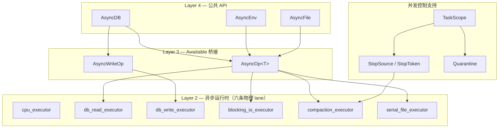
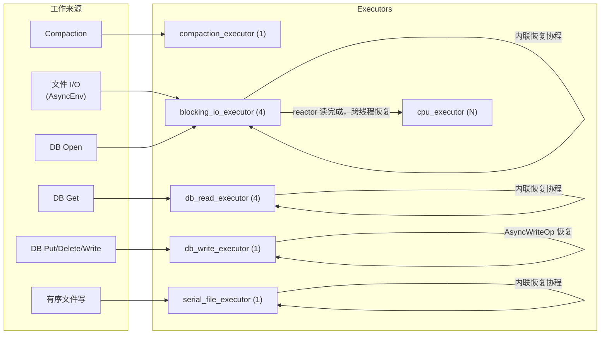
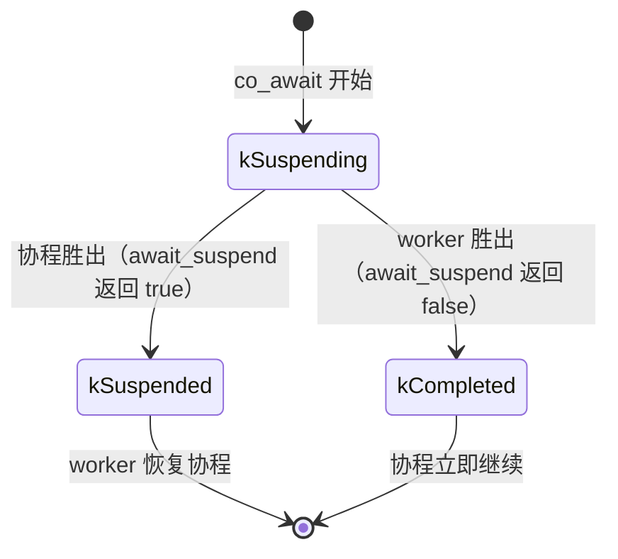
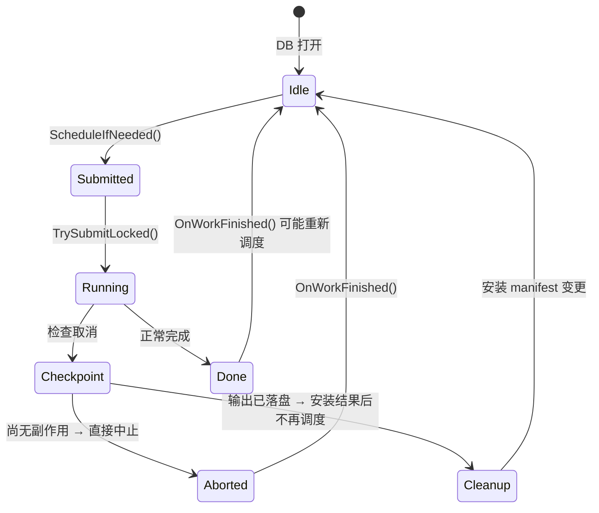

调度器处理的是工作与执行资源之间的映射：给定一组待执行任务，决定它们应当进入哪一个执行域、由哪一个线程取得，以及完成后应当在哪里继续执行。对于存储系统而言，这并非一个独立于业务语义的通用问题。点读、WAL 写入、文件元数据操作与 compaction 对顺序、阻塞和并行度的要求各不相同；若将它们置于同一资源池中，调度策略便会无意间改变存储层的延迟分布，甚至承担本应由正确性协议表达的顺序约束。

因此，Prism 的调度架构首先区分两类性质。第一类是**资源性质**：一项工作会占用 CPU，还是可能在同步 I/O 或锁等待中阻塞。第二类是**语义性质**：工作之间是否允许重排，是否要求单写者，以及取消或关机后仍需完成哪些副作用。本文将相同资源与语义约束下的一组执行资源称为一条 **lane（执行通道）**。

本文讨论 Prism 调度系统的三次主要重构。前半部分说明中央派发为何成为结构性瓶颈、物理隔离与 worker-local 队列分别解决了什么问题，以及两次失败的归因如何修正设计判断。后半部分以当前代码为依据，分析 `AsyncRuntime`、三类执行器、协程 awaitable、io_uring reactor、写协调器、发布式读视图与 compaction 控制器之间的关系。

<!-- more -->

# 第一部分 · 从中央派发到物理隔离

本部分涉及多个历史版本。代码片段与测量数据描述的是相应改动发生时的实现，不应直接视为当前工作树的接口规格。第二部分则以当前提交为观察截面；这种区分十分必要，因为部分实验性机制后来已经被删除、回退或重新实现。

## 1. 初始设计：中央提交路径的代价

第一版调度器名为 `ThreadPoolScheduler`。其拓扑并非最朴素的"单一全局队列加一把互斥量"，而是：

- N 个 worker 线程，**每个 worker 持有私有 deque 和私有互斥量**
- 一条分发线程处理全局优先队列
- 一条分发线程处理延时任务
- 一个 `pending_list_` 登记当前空闲的 worker

提交路径如下：

```cpp
void ThreadPoolScheduler::Submit(Job job, std::size_t priority) {
    { std::lock_guard lock(priority_mutex_);
      priority_queue_.push(PriorityTask{ std::move(job), priority }); }
    priority_waiter_.release();
}
```

所有前台任务都必须经过这条路径，完整链路是：

```text
Submit()
  → priority_mutex_ + priority_queue_          （全局锁 #1）
  → priority_waiter_.release()                 （semaphore 唤醒）
  → 分发线程醒来                                 （线程切换 #1）
  → TryDispatch() → pending_mutex_             （全局锁 #2）
  → worker->PushDispatched() → worker mutex    （锁 #3）
  → worker semaphore                           （线程切换 #2）
  → worker 执行完毕，回 pending_mutex_ 重新登记    （锁 #4）
```

一次提交需要获取四把互斥量、经历两次线程切换。

该拓扑的关键问题在于，私有队列只降低了消费端的竞争。每个 worker 从本地 deque 取任务时不与其他 worker 争用，但所有生产者仍需依次经过 `priority_mutex_` 与单线程分发器。因此，判断调度器的竞争程度不能只观察任务最终存放在哪里，还必须考察生产者抵达该位置之前经过的共享路径。第一版实现的最窄处正位于提交端。

该版本还存在若干独立缺陷：

**作业表示**。`using Job = std::function<void()>` 意味着每个超出小对象优化容量的可调用对象都要一次堆分配。在每秒百万级提交的场景下，这是可观测的开销。

**亲和句柄缺乏实例身份**。`Context` 仅保存 `std::thread::id`，因而 `SubmitIn()` 必须 O(N) 线性扫描以匹配线程。更严重的是，该句柄不携带"它属于哪个调度器实例"的信息——把一个池子捕获的 context 传给另一个池子会静默地索引到错误的 worker。

**派发失败时的作业丢失**。`TryDispatch(Job job)` 按值取参，因此在派发失败的分支上，作业已经被移动走了，队列中残留一个被移动后的空壳。修正分两步完成：先把调用移入临界区，再把签名改为 `TryDispatch(Job&)`，使其只在成功时消耗参数。

**析构不排空**。析构函数只 join 线程，队列中剩余的任务被直接丢弃。

## 2. 物理隔离：按阻塞性质拆分执行器

第一次改动没有更换队列算法，而是先改变执行资源的划分方式：不同阻塞性质与顺序要求的工作不再共享同一组 worker。

改动前，一个 8 线程的执行器承担全部阻塞工作，compaction 与前台读共享同一条队列。在阻塞执行器上加入分段计时后可以看到量级差异：单次 compaction 执行约 **1965 µs**，而单次点读约 **0.5 µs**——后者仅占单次操作端到端耗时的 0.6%，其余时间用于排队与等待恢复。当毫秒级的任务排在微秒级的任务之前时，后者只能等待，这是典型的队头阻塞（head-of-line blocking）。

由此可见，该阶段的主要延迟并非产生于点读本身，而是产生于点读与长时后台任务共享等待队列这一拓扑关系。

隔离后形成六条物理执行源。每条 lane 的存在依据不同：

| Lane | 依据 |
|---|---|
| DB 读（4 线程，开 stealing） | `GetAsync` 内部调用同步的 `DBImpl::Get`，会遭遇 table 读、cache miss 与元数据锁，属于真实的阻塞工作 |
| DB 写（单线程 FIFO） | 写顺序是正确性要求，单写者不变量比加锁更简单 |
| 阻塞 I/O（4 线程） | `Env` 元数据调用、reactor 无法处理的文件读、文件打开 |
| 有序文件（单线程 FIFO） | 保证 append/flush/sync/close 的提交顺序，属于正确性 lane 而非性能 lane |
| Compaction（单线程，关闭 stealing） | 后台、阻塞、单飞语义；关闭 stealing 以防止它占用其他 lane 的 worker |
| CPU 池 | 短续体、定时任务、reactor 读完成后的协程恢复 |

隔离后的测量结果（同一机器、同一组命令）：

| 变体 | 隔离前 | 隔离后 | 倍数 |
|---|---|---|---|
| V1 | 388,990 | 1,138,247 | **2.93×** |
| V2 | 506,948 | 1,194,549 | 2.36× |
| V3 | 375,908 | 1,128,880 | 3.00× |
| V4 | 440,652 | 1,148,759 | 2.61× |
| V5（10KB value，落盘） | 55,953 | 773,567 | **13.83×** |

上下文切换下降 80–89%（V1：1,137,827 → 145,765，−87.2%；V3：2,401,942 → 269,824，−88.8%）。CPU 效率指标为 **指令数 −62%、cycles −67%、task-clock −45%、IPC +17%**。

隔离本身的直接证据：前台读的平均排队等待从 38.6 µs 降至 **21.7 µs**，compaction 的队列深度峰值为 **0**——它不再在前台队列中排队。

隔离后 CPU 利用率仍为 7.2%，低于预设的 25%。该指标覆盖了 prefill、compaction 与 teardown，而被测点读的 CPU 工作仅约 0.05 秒，因此它不能单独用于判断锁竞争是否仍然存在。这里保留这一未达标结果，是为了区分“指标未达到预期”与“机制没有生效”两个不同命题。

## 3. 短路前台：worker-local 快路径与工作窃取

物理隔离完成后，中央分发器仍然存在于前台路径上。此时的候选改动是把队列替换为无锁实现。

在实施之前，先以不经过存储层的微基准测量从提交到执行的成本。该实验仅观察执行器本身：

```cpp
// All instrumentation is external — the BlockingExecutor class is UNMODIFIED.
```

结果：

| 配置 | 队列深度峰值 | 平均深度 | 平均延迟 |
|---|---|---|---|
| 4 workers / 100k tasks | 11 | 1.3 | **2.9 µs** |
| 8 workers / 50k tasks | 7 | 1.7 | 3.7 µs |
| 1 worker / 50k tasks | **459** | **96.1** | **183.5 µs** |

结果表明，在四个及以上 worker 的配置下，队列平均深度为 1.3，平均延迟不足 3 微秒，中央队列互斥量尚未饱和。因此，无锁队列并不是与证据相符的改造方向。真正需要消除的是前台任务进入中央派发链路这一事实。

### 3.1 快路径

```cpp
template <typename F>
void SubmitJob(F&& job, std::size_t priority)
{
    assert(ShouldAcceptSubmitDuringShutdown());

    if (ShouldUseFastPath(priority))                       // POLICY: priority == 0
    {
        if (current_scheduler_ == this)                    // 自提交 → 回本 worker 队列
            if (TryEmplaceToWorker(std::forward<F>(job), current_worker_index_, false, true))
                return;

        const auto worker_index = ChooseSubmissionWorker();  // 外部提交 → round-robin
        if (TryEmplaceToWorker(std::forward<F>(job), worker_index, false, true))
            return;
    }
    PushToPriorityQueue(std::forward<F>(job), priority, /*wake=*/true);   // 回落
}
```

路径分两层。若调用者本身是该池的 worker（通过 `thread_local` 判定），任务直接进入其自身队列，保留缓存局部性；否则以轮转方式选择一个 worker 直接推入。仅当两者都不适用时才回落到原有的优先队列。

非零优先级、延时任务与关机残留仍走中央路径。保留该路径的依据有四点：它是低频优先级敏感工作的自然去处；它在直接路由不可用时提供安全兜底；它使非前台残留的关机排空更简单；它保持了延时任务提升语义的连续性。

### 3.2 被放弃的保证

该改动改变了调度器对顺序的承诺，因此需要明确记录其语义边界：

> 这是一次明确的交换：放弃普通前台提交之间的严格全局顺序，换取显著更低的提交与唤醒竞争。

支撑该交换的论证是：现有测试断言的是完成性、亲和正确性、排空语义与失败快速行为，**没有任何一条依赖跨 worker 的严格前台优先级顺序**。

这种取舍必须成为接口契约的一部分。否则，后续维护者可能把非全序行为误判为实现缺陷，并重新引入中央串行化点。

### 3.3 工作窃取

引入 worker-local 队列后必须配套 stealing，否则负载分布会永久倾斜。

```cpp
std::size_t victim_index = NextRandom(rng_state) % (scheduler.work_threads_.size() - 1);
if (victim_index >= worker_index) ++victim_index;          // 排除自己，保持均匀

auto& victim = scheduler.work_threads_[victim_index];
std::scoped_lock lock(mutex_, victim.mutex_);              // 死锁安全的双锁
if (!queue_.empty()) return false;                         // 自身有任务则放弃

const std::size_t steal_count = std::max<std::size_t>(1, stealable_count / 2);
for (std::size_t i = victim.queue_.size(); i > 0 && stolen.size() < steal_count; --i) { ... }
for (auto& queued : stolen) queue_.push_front(std::move(queued));
victim.load_.fetch_sub(stolen.size(), std::memory_order_relaxed);
load_.fetch_add(stolen.size(), std::memory_order_relaxed);
```

每个 worker 持有独立的 xorshift64 状态，以黄金比例常数按索引播种：

```cpp
std::uint64_t NextRandom(std::uint64_t& state) noexcept {
    state ^= state << 13;  state ^= state >> 7;  state ^= state << 17;  return state;
}
// rng_state = (worker_index + 1) * 0x9e3779b97f4a7c15ull;
```

各项策略建立在以下约束之上：

- **随机受害者而非扫描全部 worker**：扫描所有 worker 的紧循环会重新引入刚刚消除的竞争。
- **从队尾偷取、每次偷取一半**：所有者从队首 FIFO 消费，保留自提交链的执行顺序直觉；从队尾取走可避开所有者的热点端；成批偷取比逐个偷取减少加锁次数。
- **超时退避而非忙等**：允许 `try_acquire_for(100µs)` 形式的定时重试，禁止自旋——否则等于用 CPU 自旋竞争替换互斥量竞争，总开销未必下降。

`std::scoped_lock lock(mutex_, victim.mutex_)` 同时获取两把锁。此处必须使用 `scoped_lock` 而非两个 `lock_guard`：前者内部采用死锁避免算法，后者在两个 worker 互偷时会形成循环等待。

实现过程中还暴露出一个活性缺口：worker 执行完偷取的一批任务后已经空闲，但旧判定依据的是出队前状态，因而没有重新登记。此时优先队列中仍有任务，而可用 worker 无法被分发器发现。修正后的判定在任务完成后重新检查 `queue_.empty()`，并以专门的回归测试固定这一行为。该问题不会导致崩溃，只表现为特定混合负载下的饥饿。

### 3.4 测量结果

在固定的读密集混合负载下（48 客户端 / 24 worker / 1KB value），对照改造前的同一实现：

| 指标 | 改造前 | 重设计后 | delta |
|---|---|---|---|
| 吞吐 | 716,367 ops/s | **6,444,180 ops/s** | **+799.55%（9.00×）** |
| context switches | 2,224,436 | 101,775 | **−95.42%** |
| task-clock | 27,707.88 msec | 15,089.20 msec | −45.54% |
| wall time | 12.186 s | 9.717 s | −20.26% |
| `max_inflight` | 28 | **48** | 达到配置值 |
| backend bound | 44.4 / 45.4% | 45.0 / 49.7% | 基本不变 |

行为计数器提供了机制层面的验证：

```text
foreground_fastpath_submits = 1,200,049
foreground_fallback_submits = 0            ← 无一次回落
steal_attempts              = 1,250,321
steal_successes             = 50,248       ← 成功率 4%
worker_local_jobs_completed = 1,156,299
stolen_jobs_completed       = 43,750       ← 仅 3.6% 的任务被偷取过
```

`fallback_submits = 0` 直接证明快路径在该负载下始终生效。stealing 成功率仅 4%，这正是设计预期：stealing 是负载失衡时的纠正机制，而非主要分发手段；若其成功率偏高，说明前台分发本身存在偏斜。

上述结果比较的是同一异步实现改造前后的差异，而非异步实现与同步实现的差异。同期同步对照组未能形成有效样本，因此这里能够支持的结论仅限于“新调度路径相对于旧调度路径有所改善”。

## 4. 结构简化及其正确性代价

快路径落地后，调度器的可读性明显下降。随后的一轮工作目标是简化控制流，约束条件是 release benchmark 上不超过 5% 的性能回归。

### 4.1 以测试固定语义

第一步不修改任何逻辑，只在六个测试文件中补充特征测试，把当时的语义原样固定：优先级、延时任务在关机时的提升、context 亲和、异常安全、唤醒与推进、stealing。

这是后续几次重构能够声称"零行为变更"的唯一依据。对并发组件而言，缺少语义基线的重构无法与引入回归区分。

### 4.2 策略与机制的分离

将分散在各提交路径中的布尔判定提取为具名谓词，将队列与线程操作提取为具名动作，并在头文件中以分隔线划分：

```cpp
// ── Policy helpers (path-selection decisions) ──────────────────
static bool ShouldUseFastPath(std::size_t priority) noexcept;
bool ShouldAcceptSubmitDuringShutdown() const noexcept;
static bool ShouldPromoteLazyTask(const LazyTask& task,
                                  std::chrono::steady_clock::time_point now) noexcept;

// ── Mechanics helpers (queue/thread operations) ─────────────────
void PushToPriorityQueue(Job job, std::size_t priority, bool wake = true);
```

调用点保留 `// POLICY:` 与 `// MECHANICS` 标注。若干"解释单行代码在做什么"的旧注释被删除——它们已被具名函数取代。

同时明确了不提取的部分。`TrySteal` 本身已是内聚的机械操作，"是否应该偷"就是调用它的控制流，额外包装一层谓词只增加间接层。消费循环的结构（出队 → 偷取 → 判定退出 → 退避）已足够清晰，追加标注会成为噪声。提取的判据是"是否降低了理解成本"，而非"是否可以提取"。

### 4.3 被回滚的临界区缩短

为缩短分发循环的临界区，把原有的"锁内查看、派发成功后再弹出"改为"锁内弹出、锁外派发、失败后压回"：

```cpp
PriorityTask task;
{
    std::lock_guard lock(priority_mutex_);
    if (priority_queue_.empty()) continue;
    task = std::move(const_cast<PriorityTask&>(priority_queue_.top()));
    priority_queue_.pop();                                   // 先弹出
}
if (!TryDispatch(task.job)) {
    PushToPriorityQueue(std::move(task.job), task.priority, /*wake=*/false);  // 失败压回
}
```

该改动在数十分钟后被回滚，因为它引入了两个正确性缺陷：

**优先级反转**。任务离开队列到派发成功之间存在一个窗口，在此窗口内队列的偏序保证不成立。一个优先级更低的任务可以在此期间被取出并先行执行。

**同优先级轮转**。`std::priority_queue` 对相同优先级元素不保证稳定序。反复"弹出 → 派发失败 → 压回"会使一批同优先级任务在堆中持续换位，部分任务被反复选中又反复放回，不收敛。

此外还有一个未被立即察觉的后果：`wake=false` 的重新入队不释放 semaphore。若此后不再有新的提交，分发线程不会被唤醒，任务将滞留至析构排空阶段。

修正方式是颠倒顺序——**先预约一个空闲 worker，再接触队列**，使派发必然成功，从而消除"取出但未送出"的中间状态：

```cpp
auto* worker = TryReserveIdleWorker();          // ① 先预约
if (worker == nullptr) continue;

PriorityTask task;  bool has_task = false;
{
    std::lock_guard lock(priority_mutex_);       // ② 再取任务
    if (!priority_queue_.empty()) { task = ...; priority_queue_.pop(); has_task = true; }
}
if (!has_task) { ReturnReservedIdleWorker(worker); continue; }   // ③ 空手则归还
worker->PushDispatched(std::move(task.job));     // ④ 派发必成功
```

这一案例给出了临界区拆分的一般判据：**能否拆分的标准不是"这两步之间是否存在共享数据"，而是"中间状态对外可见时，不变量是否仍然成立"**。优先队列的偏序不是队列内部的性质，而是"取出"与"消费"之间的性质；把这两步分开就等于把该性质拆掉。

两个后续事实值得记录。其一，5% 的性能预算最终未被测量——在跑 release benchmark 之前，一个 compaction 测试失败，性能结论被标记为"未测量"而非默认通过。其二，为修复该缺陷引入的预约辅助函数在数周后成为死代码：分发循环第三次改写时放弃了预约模型，改为一次唤醒排空整个队列并直推负载最低的 worker。同一段约 30 行的循环前后被改写了四次。

## 5. 归因的陷阱：profiler 指向了错误的位置

某次改动后，异步 benchmark 的吞吐从 7–8M ops/s 降至 0.7–0.8M。复现稳定：

| 版本 | prefill=1 | prefill=0 复用 |
|---|---|---|
| 改动前 | 8,175,611 ops/s | 8,203,663 ops/s |
| 改动后 | **2,429,013 ops/s** | 2,413,994 ops/s |

perf 数据高度一致地指向同步开销：

| 指标 | 慢 | 快 | 比值 |
|---|---|---|---|
| task-clock | 17,669 msec | 3,970 msec | 4.5× |
| **sys time** | **5.65 s** | **0.59 s** | **9.6×** |
| **sys %** | **32.4%** | 14.8% | 2.2× |
| instructions | 56.12B | 12.79B | 4.4× |
| branch-misses | 100.4M | 14.2M | 7.1× |
| L1 dcache misses | 663.8M | 159.0M | 4.2× |

热点符号首位是 `pthread_mutex_lock`（9.83% / 9.01%），占绝对优势。系统时间上升 9.6 倍，热点为互斥量，且该区间内确实改动过调度器的分发逻辑。基于这些证据得出的初步结论是：回归源于调度器分发路径上的锁竞争。

**该结论是错误的。**

纠正它的方法不是更细粒度的 profile，而是正交回退：建立两个独立的工作树，分别只回退一侧的改动。

| 实验 | 保留 | 回退 | 结果 |
|---|---|---|---|
| 只回退 benchmark | 调度器改动 | 3 个 benchmark 文件 | **8,037,018 / 7,876,556 ops/s —— 恢复** |
| 只回退调度器 | benchmark 改动 | 调度器头文件与实现 | **844,806 / 757,841 ops/s —— 仍然慢** |

实际原因是 benchmark 热循环中的一次整数取模：生成键的函数无条件计算 `op_index % client_keys.size()`，即每次迭代一次整数除法。在每秒数百万次的循环中，它把系统时间推高了 9.6 倍，并使 `pthread_mutex_lock` 升至火焰图首位。

这一案例的方法论含义是明确的：**profiler 报告的是等待发生在何处，而非等待由谁导致**。`pthread_mutex_lock` 位居首位只说明存在线程在锁上等待，不说明这些线程为何同时到达。当热点符号恰好与近期改动重合时，相关性会被误读为因果性。建立因果关系需要能够独立操纵变量的实验，正交回退是其中最直接的一种。

## 6. 判定性实验：确认瓶颈不在调度器

某一轮工作的目标是在投入优化之前先确定瓶颈归属。四个场景的横向对比：

| 场景 | ops/s | p50 | p95 | CPU 利用 | 主要锁 |
|---|---|---|---|---|---|
| 空闲对照 | 478,149 | 1.86 | 2.93 | 1.6 CPUs | mutex 5.1M |
| 稳态读密集 | 967,225 | 2.45 | 10.31 | 1.9 CPUs | **rwlock 32.5M** |
| executor 压力 | 667,590 | 8.20 | 25.78 | 2.0 CPUs | **rwlock 75.6M** |
| compaction 重叠 | 489,597 | 5.52 | 14.37 | 2.1 CPUs | mutex 22.8M |

关键论证：当客户端数翻倍、worker 数减半时，rwlock 竞争放大 **2.3 倍（32.5M → 75.6M）**，表明 `shared_mutex` 是串行化点。同时所有场景的 CPU 利用率均只有 1.6–2.1 个核，说明线程处于阻塞状态而非计算状态。

据此形成两个判定：

- **执行器重设计：否决**——队列与锁开销不是主要 CPU 消耗，平均延迟低于 10 µs
- **读视图重设计：通过**——读路径的引用计数操作可测量（32.5M–75.6M 锁采样）且影响实质（4c/4w 到 8c/2w 损失 31% 吞吐）

后续实施的发布式读视图（SuperVersion）结果：

| 稳态读密集 | 之前 | 之后 | delta |
|---|---|---|---|
| ops/s | 967,225 | **1,770,978** | **+83.1%** |
| p50 | 2.45 µs | 1.88 µs | −23.3% |
| p95 | **10.31 µs** | **4.19 µs** | **−59.4%** |

写路径小幅回退 7.3%，原因是写路径仍使用独占锁，且 8 clients / 2 workers 的配置受限于执行器而非锁。

同一轮中还有一个量化后决定推迟的候选项。针对 `std::function` 的替换测得：其开销约占单操作 CPU 时间的 7%（约 1.03 µs 中的 73 ns），增量堆分配占约 3%（31 ns），而 TMA 显示 60.2% Backend Bound——真正的限制是内存延迟而非可调用对象分派。结论为推迟，并同时写死了复查触发条件：若 work lambda 的捕获集缩小至 SBO 可容纳、或负载转为 CPU-bound、或因 move-only 捕获本就需要自定义可调用类型，则重新评估。

后续引入 `InlineJob` 正是因为第三个条件成立（迁移至 `std::move_only_function` 后捕获集缩小），而非基于主观判断。

## 7. 移除抽象

在架构收敛阶段，一份设计评审的结论是：旧设计在热路径上承载了过多逻辑调度角色，调度器存在过度构建。随后移除的抽象包括：

| 被移除者 | 移除依据 |
|---|---|
| `IScheduler` 虚接口 | 每次提交一次虚分派，其提供的可替换性从未被使用 |
| `ExecutorSchedulerAdapter` | 只把调用转发给另一个执行器的壳层 |
| `IContinuationExecutor` / `ThreadPoolExecutor` | 同上 |
| `BlockingScheduler()` / `ContinuationScheduler()` 路由钩子 | 绝大多数实现返回 `this` |
| `pending_list_` / `pending_mutex_` | 快路径落地后，前台任务不再经过空闲登记表 |
| `AsyncEnvBackendMode` 枚举 | 三个枚举值解析到同一个执行器 |
| runtime 全局注册表与延迟销毁队列 | 改为显式构造、显式持有 |
| `AsyncOp` 的虚 `StateBase::Execute()` | 在热路径上增加了一层 vtable 分派，无对应收益 |

类型名同时由 `ThreadPoolScheduler` 改为 `CpuThreadPool`。这不是修辞性的改动：该类的实际职责是 CPU 执行池，而非通用调度器，旧名称持续误导了对其定位的判断。

`ContinuationScheduler()` 的移除具有代表性。它在代码中有十余处引用，表面上支撑着一条重要的路由分支，但生产路径上从未被调用——`AsyncOp` 采用内联恢复。更严重的是，头文件注释明确描述了 AsyncOp 如何通过它恢复协程。**一个从未被执行的分支，配以一段描述其执行方式的注释**，比缺陷更难被发现：它不会产生错误行为，只会使后续设计建立在一个不存在的机制之上。

由此形成的架构准则是：

> 应当只有一条前台调度路径，加上少数几条物理隔离 lane。不应新增逻辑调度器，除非它保护顺序/正确性，或隔离了真实的阻塞工作。

判定一条 lane 是否应当存在的标准只有两条：它是否保护顺序或正确性；它是否隔离了真实的阻塞工作。二者皆否时，它只是一层不提供任何隔离的转发壳。

---

# 第二部分 · 当前架构

以下内容以当前提交为准。它描述的是一组彼此约束的执行域，而不是一个孤立的线程池。

## 8. 设计目标与非目标

**目标**

1. 前台提交路径上不存在跨线程的强制中转
2. 阻塞工作与非阻塞工作在物理上不共享执行资源
3. 顺序敏感的工作由调度保证单写者，而非由数据结构加锁保证
4. 协程恢复默认不产生额外的队列跳转
5. 关机时不丢失任何已提交的工作
6. 任何未捕获异常都是缺陷，采取失败快速策略

**非目标**

1. 不保证跨 worker 的全局提交顺序
2. 不提供抢占；所有任务运行至完成
3. 不提供抢占式优先级或端到端公平性界限；优先级只规定中央回落队列的取出顺序
4. 不提供跨调度器实例的工作迁移
5. 不追求通用性——每一条 lane 都是为具体的调用点设立的

## 9. 分层结构



层间的核心约束是：**上层只能"提交到某个执行器"，不能"查询应当提交到哪个执行器"**。路由是构造期确定的静态事实，不是运行期的动态决策。移除 `IScheduler` 系列抽象换来的正是这一约束——它把"目标执行器"从一个可以在运行时改变的间接层，变成了调用点上可见的常量。

### 9.1 所有权与构造边界

`AsyncRuntime` 并不拥有 CPU 池，而是保存对外部 `CpuThreadPool` 的引用。其余五条 lane 与 `IoDispatcher` 由运行时按值持有：

```cpp
class AsyncRuntime {
    CpuThreadPool& cpu_executor_;                 // 非拥有
    BlockingExecutor db_read_executor_;           // 拥有
    SerialExecutor db_write_executor_;            // 拥有
    BlockingExecutor blocking_io_executor_;       // 拥有
    IoDispatcher io_dispatcher_;                  // 借用 blocking_io_executor_
    BlockingExecutor compaction_executor_;        // 拥有
    SerialExecutor serial_file_executor_;         // 拥有
};
```

成员声明顺序同时规定了析构顺序。C++ 按声明的逆序析构成员，因此 `io_dispatcher_` 会先于它所借用的 `blocking_io_executor_` 停止；CPU 池则必须由运行时的外部所有者保证存活。这里的所有权关系并非实现细节，因为 `AsyncOp` 和 I/O 完成回调均保存非拥有的执行器引用。

数据库实例在打开时进一步建立两条面向存储语义的绑定：

```text
DBImpl
├── WriteCoordinator  ──借用──> db_write_executor
└── CompactionController ─借用──> compaction_executor
```

因此，写入顺序与 compaction 单飞不由调用者临时选择，而是在 `DBImpl` 的构造阶段固定下来。

## 10. 执行 lane 规格

| Lane | 实现 | 线程数 | 存在依据 | 移除后的后果 |
|---|---|---|---|---|
| **CPU 池** | `CpuThreadPool` | `max(hw, 2)` | 短续体、定时任务、reactor 读的协程恢复 | reactor 完成回调将在 pump 线程上执行用户逻辑，阻塞后续完成事件的收割 |
| **DB 读** | `BlockingExecutor`，开启 stealing | 4 | `GetAsync` 内部为同步 `DBImpl::Get`，会遭遇 cache miss 与元数据锁 | 阻塞读占用 CPU 池 worker |
| **DB 写** | `SerialExecutor` | 1 | 写顺序即正确性 | 写组顺序不可控；memtable 需要额外的多写者保护 |
| **阻塞 I/O** | `BlockingExecutor` | 4 | `Env` 元数据、reactor 无法处理的文件读、文件打开 | 一次 `stat` 可以卡住协程续体 |
| **Compaction** | `BlockingExecutor`，**关闭 stealing** | 1 | 后台、阻塞、单飞 | 毫秒级 compaction 排在微秒级点读之前 |
| **有序文件** | `SerialExecutor` | 1 | append/flush/sync/close 的 FIFO 顺序 | 文件操作乱序完成 |



图中最后一条边表示文件读取的恢复边界：无论 I/O 由 reactor 还是阻塞回落路径完成，`async_env.cpp` 都会把续体提交到 CPU 池。一般的 `AsyncOp` 则在完成工作的 executor 线程上内联恢复，其依据见第 15 节。

线程预算方面，默认配置包括：外部 CPU 池的 N 个 worker 与两条分发线程，DB 读 4、阻塞 I/O 4、compaction 1、DB 写 1、有序文件 1，以及 reactor 的一条 pump 线程。除 CPU 池外，各 lane 的线程数在构造时确定，运行期间不自动伸缩。工作窃取只能在同一个 `BlockingExecutor` 实例的分片之间发生，不能跨越 lane；物理隔离因而不会被负载均衡机制破坏。

## 11. 作业表示：`InlineJob`

```cpp
class InlineJob
{
public:
    static constexpr std::size_t kInlineBytes = 128;

private:
    using InvokeFn  = void (*)(void*);
    using DestroyFn = void (*)(void*) noexcept;
    using DeleteFn  = void (*)(void*) noexcept;
    using MoveFn    = void (*)(void*, void*) noexcept;

    template <typename Fn>
    static constexpr bool kUseInlineStorage = sizeof(Fn) <= kInlineBytes
        && alignof(Fn) <= alignof(std::max_align_t)
        && std::is_nothrow_move_constructible_v<Fn>;

    alignas(std::max_align_t) std::byte storage_[kInlineBytes];
    void* ptr_{ nullptr };
    InvokeFn invoke_{ nullptr };
    DestroyFn destroy_{ nullptr };
    DeleteFn delete_{ nullptr };
    MoveFn move_{ nullptr };
    bool heap_allocated_{ false };
};
```

这是一个 move-only 的 `void()` 包装，以四个函数指针手工实现类型擦除，而非依赖编译器生成的 vtable。

**存储策略**。满足三个条件时使用内联存储，否则堆分配：

```cpp
if constexpr (kUseInlineStorage<Fn>) {
    ptr_ = StoragePtr();
    std::construct_at(static_cast<Fn*>(ptr_), std::forward<F>(f));
    heap_allocated_ = false;
} else {
    ptr_ = new Fn(std::forward<F>(f));
    heap_allocated_ = true;
}
```

三个条件各自必要。尺寸约束是显然的；对齐约束保证 `storage_` 的 `max_align_t` 对齐足够；`is_nothrow_move_constructible_v` 是关键的一条——移动 `InlineJob` 时需要把内联存储中的对象搬到新位置，该步骤不能抛出，否则移动构造函数无法保持 `noexcept`，而容器操作依赖这一点。

**移动语义的分支**。堆分配的情形只需转移指针；内联的情形必须逐对象移动构造，并显式析构源对象：

```cpp
if (other.heap_allocated_) {
    ptr_ = other.ptr_;
    other.ptr_ = nullptr;
} else {
    ptr_ = StoragePtr();
    move_(other.ptr_, ptr_);
    other.destroy_(other.ptr_);
}
```

**空间与分配的交换**。`sizeof(InlineJob)` 为 176 字节。即每个队列槽位以 176 字节的常驻空间，换取绝大多数作业零堆分配。该交换的有效性取决于队列深度：在实测平均深度 1.3、作业生命周期为微秒级的场景下是有利的；若队列会堆积上万个作业，该结论应当反转。

**与 `std::move_only_function` 的关系**。后者曾是 `Job` 的实现，替换的动机是其小对象优化容量不足以容纳典型的 work lambda（捕获集包含 `shared_ptr`、`string` 与 options，约 64 字节，超出 libstdc++ 24 字节的可用 SBO），从而每次提交触发一次堆分配。

**配套的就地构造**。以 C++20 `requires` 约束的模板重载，使调用点直接把可调用对象构造进目标队列槽位，省去一次 `InlineJob` 移动：

```cpp
template <typename F>
    requires(!std::is_same_v<std::decay_t<F>, Job>)
void Submit(F&& job) { SubmitJob(std::forward<F>(job), 0); }
```

同样的模式贯穿 `SubmitAfter`、`SubmitIn`、`WorkThread::Emplace` 与 `PushToPriorityQueue`。这也是 `thread_local` 状态由匿名命名空间提升为类静态成员的原因——模板实现必须放在头文件中。

## 12. 提交引用：`ExecutorRef`

```cpp
struct ExecutorRef
{
    using Job = InlineJob;

    void* executor = nullptr;
    void (*submit)(void*, Job) = nullptr;

    ExecutorRef() = default;

    template <typename Executor>
        requires(!std::is_same_v<std::decay_t<Executor>, ExecutorRef>)
    explicit ExecutorRef(Executor& target)
        : executor(&target)
        , submit([](void* ptr, Job job) { static_cast<Executor*>(ptr)->Submit(std::move(job)); })
    {}

    void Submit(Job job) const { submit(executor, std::move(job)); }
};
```

一个非拥有的、非虚的提交引用。它取代了 `IScheduler` 虚接口，语义上只提供一个操作：把作业提交到构造时绑定的执行器。

它**不提供**的操作同样重要：不能查询目标执行器的身份，不能改变路由，不能获取"阻塞执行器"或"续体执行器"。这些能力在旧设计中存在，且正是它们使得"目标执行器"成为一个运行时可变的间接层，进而使调用点无法在静态上确定工作会在哪里执行。

调度器头文件与运行时头文件中 `virtual` 关键字出现零次。

## 13. CPU 执行池：`CpuThreadPool`

### 13.1 内部结构

```text
CpuThreadPool
├── work_threads_[N]            每 worker：mutex + deque<QueuedJob> + counting_semaphore + atomic load
├── submit_cursor_              外部提交的轮转游标（relaxed fetch_add）
├── priority_queue_ + mutex     非零优先级 / 快路径回落
├── lazy_queue_ + mutex         延时任务（按 deadline 的最小堆）
├── priority_waiter_            优先级分发线程的信号量
├── lazy_waiter_                定时分发线程的信号量
├── priority_thread_            优先级分发线程
├── lazy_thread_                定时分发线程
├── exit_flag_                  关机标志
└── thread_local current_scheduler_ / current_worker_index_
```

`thread_local` 的两个变量承担了两项职责。其一是快路径判定：把"当前线程是否属于本池"退化为一次指针比较。其二是为 `Context` 提供实例身份——从其他池捕获的 context 会被识别并安全回落，而不是索引到本池中同序号的 worker。

### 13.2 四条提交路径

| 接口 | 目标 | 可被偷取 | 生产用途 |
|---|---|---|---|
| `Submit(job)` | 自提交回本 worker；外部按 `submit_cursor_` 轮转 | 是 | reactor 读的协程恢复 |
| `SubmitWithPriority(job, p)` | `p == 0` 同上；`p > 0` 进优先队列并由分发线程投递 | 是 | 无 |
| `SubmitAfter(deadline, job)` | 进 `lazy_queue_`，到期后直推负载最低的 worker，失败回落优先队列 | 是 | 无 |
| `SubmitIn(ctx, job)` | 严格投递到 `ctx` 指定的 worker；context 无效或跨池则回落 `Submit` | **是** | 无 |

两个选择器承担不同角色：`ChooseSubmissionWorker()` 是一次 relaxed 的 `fetch_add` 取模，用于外部提交的快路径，代价常数；`ChooseLeastLoadedWorker()` 遍历所有 worker 的近似负载计数，代价 O(N)，只用于延时任务投递与关机排空——这些路径频率低，可以承受扫描。

`SubmitIn` 的契约有一点反直觉，因而在头文件中写了完整说明：

```cpp
// Strict affinity: when ctx was captured from a worker of THIS scheduler instance,
// the job is pushed directly to that exact worker's local queue. The job remains
// stealable — other workers may steal it under load, but the affinity-push
// maximizes the chance the same-worker executes it.
```

**亲和是尽力而为，而非保证。** 若保证亲和，则单个 worker 阻塞会拖住绑定其上的全部任务；允许被偷取则以缓存局部性换取活性。该设计选择了活性。

### 13.3 消费循环

worker 的消费循环是两层结构：

```cpp
while (true) {
    semaphore_.acquire();                          // 外层：无工作时完全阻塞
    while (true) {
        // 1. 从本地队列出队并执行
        // 2. 本地为空 → TrySteal → 成功则 continue
        // 3. 偷不到且已请求退出 → break
        if (!semaphore_.try_acquire_for(kStealBackoff)) break;   // 退回外层重新阻塞
    }
    if (scheduler.IsExitRequested()) {
        std::lock_guard lock(mutex_);
        if (queue_.empty()) break;
    }
}
```

外层的无限期阻塞保证空闲 worker 不消耗 CPU；内层的 100 µs 定时等待使得刚刚变空的 worker 在短时间内保持"热"，避免频繁的完全阻塞与唤醒。`kStealBackoff` 的作用是把"偷取失败"与"进入深度休眠"分开：偷取失败不立即休眠，而是给上游一个短窗口继续投递。

关机时的退出条件是合取式的——**必须同时满足"已请求退出"与"本地队列为空"**。只检查退出标志会导致快路径任务在关机时被遗留在 worker 队列中。

### 13.4 策略与机制的分层

头文件中显式区分两类辅助函数：

- **策略**（路径选择判定）：`ShouldUseFastPath(priority)`、`ShouldAcceptSubmitDuringShutdown()`、`ShouldPromoteLazyTask(task, now)`
- **机制**（队列与线程操作）：`PushToPriorityQueue(job, priority, wake)`、`TryPushToWorker` / `TryEmplaceToWorker`、`DispatchExpiredTask`、`PromoteLazyResidueToWorkers`、`DrainLazyQueueToEmpty`、`DrainPriorityQueueToEmpty`、`DrainWorkerLocalQueues`、`TryDequeueJob`、`HandleJobCompletion`

这一划分的实际收益是：策略函数全部是纯判定，可以独立阅读与测试；机制函数全部无分支决策，可以独立验证其效果。析构函数的排空主体因此从约 45 行内联代码缩减为 4 次具名调用，消费循环的作业处理从约 28 行缩减为 5 行。

## 14. 三类执行器与工作窃取

当前运行时使用三种执行器。它们共享 `InlineJob` 作为作业表示，但不共享队列，也不试图提供相同的顺序语义。

| 类型 | 队列拓扑 | 顺序语义 | 适用工作 |
|---|---|---|---|
| `CpuThreadPool` | 每 worker 一个 deque，另有优先级与延时队列 | 普通提交无全局顺序；支持尽力而为的亲和 | 短续体、延时任务 |
| `BlockingExecutor` | 每 worker 一个 64 字节对齐的 shard | 多线程时无全局 FIFO；可按实例关闭 stealing | DB 读、阻塞 I/O、compaction |
| `SerialExecutor` | 单 deque、单 worker、condition variable | 提交顺序上的 FIFO | DB 写协调、有序文件操作 |

`SerialExecutor` 的价值不在于减少锁开销，而在于将“同一时刻至多有一个工作推进”编码为执行器性质。`BlockingExecutor` 则把阻塞线程限制在所属 lane 内。`CpuThreadPool` 保留优先级、延时与亲和接口，但其普通前台提交路径直接面向 worker-local 队列。

### 14.1 `CpuThreadPool` 的窃取协议

| 维度 | 策略 | 依据 |
|---|---|---|
| 触发 | 本地队列为空 | 有本地工作时偷取只会增加竞争 |
| 受害者选择 | xorshift64 随机，均匀排除自身 | 避免扫描全部 worker 重新引入竞争 |
| 加锁 | `scoped_lock` 同时锁自身与受害者 | 双向偷取会形成循环等待，需要死锁避免算法 |
| 前置检查 | 双锁下重查自身队列非空则放弃 | 加锁期间可能已有新任务投递到自身 |
| 偷取量 | 可偷任务的一半，至少 1 个 | 摊薄加锁成本，同时避免一次搬空导致反向倾斜 |
| 偷取端 | 受害者队尾 | 所有者从队首消费，队尾冲突最小 |
| 放置端 | 自身队首 | 批内顺序翻转，批间保序 |
| 失败退避 | `try_acquire_for(100µs)` | 定时重试允许，忙等禁止 |

负载计数器 `load_` 以 `memory_order_relaxed` 维护，是**近似值**。这是有意的：它只用于选择投递目标，误选的代价是一次轻微的负载不均，而 stealing 会纠正它；为此付出顺序一致性的代价不划算。

### 14.2 `BlockingExecutor` 的分片

`BlockingExecutor` 采用相同的“本地优先、空闲时窃取”原则，但队列被组织为独立分片：

```cpp
struct alignas(64) Shard {          // 64 字节对齐，隔离伪共享
    std::mutex mutex;
    std::deque<Job> queue;
    std::counting_semaphore<> semaphore{ 0 };
    std::atomic<std::size_t> load{ 0 };
};
std::vector<std::unique_ptr<Shard>> shards_;
std::atomic<std::size_t> submit_cursor_{ 0 };
```

分片以 `unique_ptr` 持有而非直接放入 `vector`，以保证 `alignas(64)` 在动态分配下仍然生效。

`enable_stealing` 是构造参数。compaction lane 以单 worker 构造并显式关闭 stealing。需要注意，stealing 本来就不会跨 `BlockingExecutor` 实例发生；关闭该选项表达的是 compaction lane 自身不需要并行窃取语义，而不是防止它从 DB 读 lane 获取任务。

`BlockingExecutor` 另有一个重入快路径：

```cpp
template <typename F>
bool TryRunInline(F&& work)
{
    if (!IsCurrentWorker()) return false;
    work();
    return true;
}
```

返回 `bool` 而非直接排队，使调用方可以在内联检查失败之后再惰性构造排队所需的闭包——避免为一条大概率不会走的路径提前付出构造代价。

`AsyncGetOp::State::Start` 是该接口的实际调用点。若一次点读在 DB 读 worker 上递归发起，工作会直接执行；否则才构造闭包并提交到 `db_read_executor_`。这一安排避免了同一 lane 内部不必要的再次排队，同时没有把该优化开放为跨 lane 的内联执行。

## 15. 协程恢复：三态握手

`AsyncOp` 的类注释完整描述了它要关闭的竞态：

```cpp
// Suspend/Resume Handshake (race safety):
// There is a classic race between the worker completing and the coroutine suspending:
//
//   Thread A (coroutine): enters await_suspend(), submits work, then sets state to kSuspended.
//   Thread B (worker):    completes work, then attempts to resume the coroutine.
//
// If Thread B runs to completion BEFORE Thread A transitions state to kSuspended,
// calling handle.resume() before the coroutine is actually suspended is UB.
//
// Protocol (atomic state machine, three states):
//   kSuspending → either kCompleted (worker wins) or kSuspended (coroutine wins)
//
// This guarantees:
//   - Exactly-once resume.
//   - No resume-before-suspend.
//   - No lost wakeup.
```



竞态的两端通过一次 CAS 决出胜负：胜方负责推进，败方不做任何事。若协程胜出（先完成挂起），worker 后续调用 `handle.resume()`；若 worker 胜出（工作先完成），`await_suspend` 返回 `false`，协程根本不挂起，直接继续执行。

**恢复位置**。默认情况下，恢复内联在完成该工作的 worker 上，不再向队列投递一次。这消除了每个操作一次额外的 `Submit()`——在每秒数百万次操作的规模下，这一跳的成本可观测。

代价是完成线程会继续执行用户的协程体。对阻塞 lane 而言这是正确的（它本就用于执行阻塞工作）；对 reactor pump 线程而言这是错误的，因此那条路径是唯一的例外：

```text
reactor 完成 → 存储结果 → CpuExecutor().Submit(resume)
```

pump 线程只有一条，在其上执行任意用户逻辑会阻塞后续所有完成事件的收割。

**生命周期前提**。awaiter 的状态由挂起的协程帧持有（`unique_ptr`），worker 在调用 `handle.resume()` 之后不再接触该状态。因此不变量是：**等待中的协程必须存活至恢复完成**。这一前提取代了早期版本中的 `shared_ptr`，消除了每次操作一对原子的引用计数增减。

## 16. 异步 I/O：手写 io_uring reactor

`IoReactor` 是直接针对 `linux/io_uring.h` 的手写绑定，不依赖 liburing：raw `syscall(SYS_io_uring_setup / SYS_io_uring_enter / SYS_io_uring_register)`，自行 `mmap` 提交队列与完成队列环，自行填写 `io_uring_sqe`，以 `std::atomic_ref` 访问环的头尾指针。

| 维度 | 规格 |
|---|---|
| 能力探测 | 内核版本 ≥ 5.1，且一次 `io_uring_setup` 成功（随后立即关闭） |
| 环容量 | 默认 256 entries |
| 支持操作 | read / write / fsync |
| 请求关联 | 每请求分配 `user_data`，pump 线程据此在 in-flight 表中查回调 |
| 能力级回落 | io_uring 不可用时，整条路径改走 `BlockingExecutor` |
| 操作级回落 | 提交或完成结果表明操作不受支持时，执行对应的同步系统调用 |
| 恢复 | `IoDispatcher` 调用完成回调；由上层决定内联推进还是向 CPU 池投递 |

`IoDispatcher` 在其上提供请求队列、pump 线程与 in-flight 表。它负责完成事件的多路复用，但不直接规定协程应当在哪里恢复：

```text
调用方 → SubmitRead/Write/Fsync（附完成回调）
      → pending_requests_ 队列
      → pump 线程取出，填 sqe，io_uring_enter 提交
      → in_flight_[user_data] = state
      → pump 线程阻塞在 WaitCompletion
      → 完成事件到达 → 查表 → 执行完成回调
      → async_env 的读回调向 CPU 池提交续体
        或 AsyncWalWriter 继续提交 fsync / 完成写组
```

这种分层在实际代码中形成两条不同的完成链。

对于随机读：

```text
IoDispatcher pump
  → 形成 Result<size_t>
  → CpuThreadPool::Submit
  → 运行 completion / 恢复读取协程
```

对于 WAL 写入：

```text
WriteCoordinator 规划写组
  → AsyncWalWriter::Write
  → io_uring write
  → 若 sync=true，再提交 io_uring fsync
  → 回调重新提交到 db_write_executor
  → CommitWriteGroupForCoordinator
  → 发布完成并恢复等待者
```

这表明 pump 线程并非纯粹的字节搬运线程：WAL 完成回调会在其上推进一个有限状态机，但真正的写组提交仍被重新送回串行写 lane。相反，文件随机读的用户续体始终经由 CPU 池恢复，以避免在唯一的 pump 线程上执行不可控的上层逻辑。

当前实现还有一个明确边界：reactor 的单操作回落在 pump 循环中直接执行同步 `pread`、`pwrite` 或 `fsync`。若内核在提交阶段或完成阶段拒绝某个 opcode，pump 线程可能因此阻塞。整条 reactor 不可用时的能力级回落则由 `BlockingExecutor` 承担。二者不应混为同一种回落语义。

## 17. 结构化并发：取消与结果隔离

代码库还包含一组结构化并发原语，但其成熟度与生产接入程度并不相同。当前存储主路径实际使用的是 `StopSource` / `StopToken`：`CompactionController` 以它们传递停止请求，`DBImpl::BackgroundCompaction` 与 `DoCompactionWork` 在阶段边界观察 token。`TaskScope`、`OperationState` 与 `Quarantine` 已有实现和测试，但尚未成为 AsyncDB 通用操作的统一生命周期层。

**`StopSource` / `StopToken`**。取消信号的发布与观察。`StopToken` 支持链式父子关系：子 token 观察自身与全部祖先的取消状态，因而一次父级取消可以传播到整棵任务树，而无需维护反向的注册表。

**`Quarantine`**。该组件用于容纳“取消之后才到达的结果”。取消一个已经启动的操作并不等于撤销其物理副作用；操作仍可能完成，只是其原接收者已经退出生命周期。直接写回可能访问失效目标，直接丢弃则可能隐藏资源清理责任，因此隔离区保存结果类别、值或异常，供 scope 在 join 后统一检查。

**`OperationState`**。将上述判定收敛到一处临界区。其状态机为：

```text
TryStart()   → 若已请求取消，标记 quarantined 并返回 false
             → 否则标记 started 并返回 true
Complete(v)  → 若已完成，直接返回（保证恰好一次）
             → 若已取消，把 v 放入隔离区
             → 否则把 v 应用到目标
Cancel()     → 标记 cancelled；若尚未启动，立即进入隔离
```

关键在于 `Complete` 中"是否取消"的判定与"应用结果"必须处于同一个决策点内：若先判定后应用，判定与应用之间的取消会导致结果被写入一个已失效的目标。

**`TaskScope`**。为一组子任务提供统一的取消源、`in-flight` 计数与 join 点。

## 18. 存储侧耦合：写路径、读视图与 compaction

调度器的形状很大程度上由存储引擎的读写路径决定。

### 18.1 写路径

```text
AsyncDB::PutAsync / WriteAsync
  → WriteCoordinator（每 DB 一个）
  → db_write_executor（SerialExecutor，1 线程）
  → 分组：至多 128 个请求 / 1 MiB，且 sync 属性相同
  → PlanWriteGroupForCoordinator
  → AsyncWalWriter：append → 可选 fsync
  → 回到 db_write_executor
  → CommitWriteGroupForCoordinator
  → 完成请求并恢复等待者
```

`WriteCoordinator` 自身还以 `queue_`、`drain_scheduled_` 与 `group_in_flight_` 表达调度状态。`group_in_flight_` 保证任一时刻至多有一个写组处于 WAL 阶段；`drain_scheduled_` 防止多个调用者重复向串行执行器提交 `Drain()`。这两个状态与 `SerialExecutor` 的单 worker 共同建立单写者不变量。

WAL I/O 并不会一直占用写 worker。规划完成后，`AsyncWalWriter` 通过 `IoDispatcher` 异步提交 append 与可选 fsync；完成回调再把提交阶段送回 `db_write_executor`。因此，“任一时刻至多有一个写组处于 `in flight` 状态”是协调器的显式策略，而不是串行线程被同步 I/O 被动占用的结果。

写组的顺序约束是严格的：**规划序列号 → WAL 追加 → 可选 sync → 应用到 memtable → 发布可见序列 → 完成请求**。协调器在恢复当前组的客户端协程之前，先预留并提交下一组 WAL，使客户端续体可以与下一次 I/O 重叠，但这不会改变可见序列的发布顺序。分组上限与 `sync` 属性边界共同限制批次大小和持久性语义。

### 18.2 读路径

读路径经历了三个阶段：独占互斥量 → 读写锁 → 发布式读视图。

第三阶段的动因见第 6 节：读写锁的竞争随并发度放大，成为串行化点。当前发布式读视图并非简单地延迟两代后回收，而是使用 **64 个分片读计数器与两个 epoch** 关闭“读取指针后对象被释放”的窗口。

点读首先读取 `point_read_epoch_`，递增该 epoch 下当前线程所属分片的计数器，再以 acquire 语义加载 `super_version_`。如果期间 epoch 改变，或视图记录的 epoch 与当前 epoch 不一致，则撤销计数并重试：

```text
读 epoch e
  → readers[e][shard]++
  → load(super_version)
  → 再次验证 epoch 与 view.point_read_epoch
  → 成功：无锁读取 mem / imm / Version
  → readers[e][shard]--
```

发布者在持有 `DBImpl::mutex_` 独占锁时构造新 `SuperVersion`，并仅在另一个 epoch 的全部分片计数为零时切换过去、回收该 epoch 上一次使用时退休的视图。随后通过 `super_version_.exchange(..., acq_rel)` 发布新视图。若备用 epoch 尚未空闲，发布仍可进行，但继续沿用当前 epoch，并推迟回收。

因此，点读不需要对 `SuperVersion` 做逐次引用计数；跨调用存活的迭代器仍显式持有引用。该方案接近轻量级 epoch reclamation：它以固定数量的分片原子计数换取无共享锁的点读，并把回收判断集中在低频发布路径。

### 18.3 Compaction 生命周期

`CompactionController` 把后台 compaction 的生命周期结构化，其状态被拆分为两个独立的布尔量：`work_requested_`（已观察到需求）与 `lane_active_`（已排队或正在运行）。单飞语义由此自然成立——请求只翻转前者，提交时若后者已为真则丢弃重复提交。

取消检查点有三个，各自的语义不同：



1. **启动前**：在挑选 compaction 之前停止，无任何副作用
2. **提交前**：在写 manifest 之前停止，释放输入、唤醒写者
3. **提交后**：输出已在磁盘上，仍需安装 manifest 变更，但抑制后续调度

第三个检查点最容易被遗漏：在输出文件已经创建之后直接中止，会留下不被任何版本引用、也不会被清理的孤儿文件。

## 19. 关机协议与所有权

`CpuThreadPool` 的关机契约固定在头文件中：

```text
// - Shutdown Protocol:
//   - Exit() sets exit_flag_, wakes all threads.
//   - Draining: Dispatcher threads and worker threads drain their respective queues before exiting.
//   - Late Submissions: Submissions during shutdown from threads *external* to this scheduler
//     are unsupported. However, submissions from jobs already running on this scheduler's
//     worker threads are supported and drained.
//   - Delayed Tasks: Pending SubmitAfter tasks are promoted to immediate execution during shutdown.
//   - Destruction: Destructor calls Exit() and joins all threads.
//   - Exception Policy: Any exception escaping a Job is a bug; the scheduler catches
//     and calls std::terminate() (fail-fast).
```

四个阶段：

```text
① 设置 exit_flag_，释放所有信号量
② join 前把延时任务残留推给 worker（否则它们再无机会被消费）
③ join 定时线程 → join 优先级线程 → join 全部 worker
④ 单线程不动点排空
```

第四阶段必须是不动点循环，因为排空过程中执行的任务可能再次提交：

```cpp
while (work_remains) {
    work_remains = false;
    DrainLazyQueueToEmpty(work_remains);
    DrainPriorityQueueToEmpty(work_remains);
    DrainWorkerLocalQueues(work_remains);
}
```

析构线程在此期间临时把 `current_scheduler_` 指向自身，使排空中的重入提交能够通过调试期断言。

三类执行器的关机策略并不完全相同。`SerialExecutor` 设置 `stopping_` 后唤醒 worker；worker 仅在队列为空时退出，因此已入队工作会被排空。`BlockingExecutor` 设置原子停止标志，释放每个 shard 的 semaphore，等待 worker 在所有 shard 均为空后退出，并在 join 后防御性地顺序排空残留任务。

`BlockingExecutor` 还明确禁止从自身 worker 内析构：

```cpp
if (IsCurrentWorker()) { std::terminate(); }
```

原因不仅是 self-join 会失败，还在于 worker 当前正在使用执行器的 shard、停止标志与线程容器。简单 detach 不能延长这些对象的生命周期。因此，当前实现将 worker 内析构视为违反所有权契约，并采取失败快速策略。历史版本曾讨论过把协调状态提升到共享堆对象的方案，但该方案不属于当前实现。

`AsyncRuntime` 的成员顺序为这些协议提供了静态保障：`serial_file_executor_` 和 `compaction_executor_` 先停止，随后 `io_dispatcher_` 停止 pump，最后才销毁其回落所依赖的 `blocking_io_executor_`。外部 CPU 池不在该析构链内，调用者必须保证它晚于运行时退出。

**异常策略**为失败快速：所有执行点包裹 `try { job(); } catch (...) { std::terminate(); }`。依据是任何逃逸出作业的异常都意味着调用方违反了契约，此时继续运行只会把损坏状态扩散到其他任务。

## 20. 可观测性

调度器自带六个计数器（编译期开关，默认关闭）：

```cpp
std::atomic<uint64_t> foreground_fastpath_submits;   // 绕过分发器的提交
std::atomic<uint64_t> foreground_fallback_submits;   // 回落到优先队列的提交
std::atomic<uint64_t> steal_attempts;                // TrySteal 调用次数
std::atomic<uint64_t> steal_successes;               // 实际转移了作业的次数
std::atomic<uint64_t> worker_local_jobs_completed;   // 从自身队列完成
std::atomic<uint64_t> stolen_jobs_completed;         // 被偷取后完成
```

这六个数有固定的读法：

| 观察量 | 期望 | 偏离的含义 |
|---|---|---|
| `fallback_submits` | 接近 0 | 快路径在某些场景下未生效 |
| `steal_successes / steal_attempts` | 个位数百分比 | 偏高说明前台分发本身不均衡 |
| `stolen / worker_local` | 低比例 | 负载倾斜程度的直接读数 |

结构化并发层另有四个：

```cpp
std::atomic<std::size_t> cancelled_before_start;        // 启动前即被取消
std::atomic<std::size_t> cooperative_checkpoint_cancel; // 在协作检查点被取消
std::atomic<std::size_t> late_completion_quarantined;   // 取消后到达的结果被隔离
std::atomic<std::size_t> fallback_to_blocking_count;    // reactor 回落到阻塞路径
```

计数器默认关闭是一个有依据的决定：在当前仪表密度下其开销约为 15%，对于一个以微秒计的热路径而言不可忽略。可观测性与零开销之间的取舍在此偏向后者，代价是诊断时需要重新编译。

## 21. 测试契约

调度器的正确性由六个测试文件固定，共 57 个测试，全部在 ASan / LSan / UBSan 下运行：

| 文件 | 测试数 | 固定的契约 |
|---|---|---|
| `scheduler_shutdown_test` | 15 | 四阶段排空、延时任务提升、worker 重入提交 |
| `scheduler_context_test` | 12 | Context 实例身份、跨池 context 回落 |
| `scheduler_invariant_test` | 8 | 队列与负载计数不变量 |
| `scheduler_pending_regression_test` | 8 | 偷取批次排空后的重新登记 |
| `scheduler_exceptions_test` | 8 | 失败快速 |
| `scheduler_stress_test` | 6 | 混合负载 |

测试方针为：**全部使用确定性屏障与测试钩子，不使用随机压测；不睡眠、不依赖时序、不需要外部同步。**

这一方针的依据是可判定性：一个只能通过"重复运行足以碰到"来复现的并发缺陷，无法用于验证修复是否有效——修复后仍然可能只是把复现概率降低了。确定性屏障把竞态的两端固定在可控的顺序上，使得"修复前必然失败、修复后必然通过"成为可验证的性质。

需要注意的一类干扰是测试自身的缺陷。例如某个回归测试曾假设"两次连续提交在双 worker 池上必然落到不同 worker"，而负载计数器的递减与选择器的读取本身存在竞态，两次探测合法地可能返回同一个 worker。又如一份 sanitizer 报告指向读路径的原子加载，实际原因是测试通过一个已释放的 `unique_ptr` 中取出的裸指针继续调用方法——即测试自身违反了所有权契约，而非被测代码存在缺陷。

另有一类工具层面的假阳性需要预先约定写法：协程在另一线程恢复时，若捕获了发起线程栈上的局部变量，AddressSanitizer 会报告 `stack-use-after-scope`。这是已知的工具局限（其提示中亦说明"若程序使用了自定义的栈展开机制，这可能是假阳性"）。约定是协程测试不使用带捕获的 lambda，而把状态作为显式参数传入立即调用的协程 lambda。

## 22. 量化画像

| 维度 | 值 |
|---|---|
| 物理执行源 | 6（CPU 池 + 2 个 BlockingExecutor + compaction lane + 2 个 SerialExecutor） |
| 默认线程数 | CPU 池 N + 2 分发；DB 读 4；阻塞 I/O 4；compaction 1；DB 写 1；有序文件 1；reactor pump 1 |
| 前台提交路径上的锁 | 1（目标 worker 的队列锁） |
| 前台提交路径上的线程切换 | 0 |
| 每作业堆分配 | 0（捕获集 ≤ 128 字节时） |
| 一般 `AsyncOp` 完成后的额外队列跳转 | 0（文件读恢复为 1；写组有独立状态链） |
| 热路径上的虚分派 | 0 |
| 调度器测试 | 57，全部在 ASan/LSan/UBSan 下 |

与初始设计对照，前台提交路径的锁数量从 4 降至 1，线程切换从 2 降至 0，作业的堆分配从每次一次降至零。这三项变化解释了实测中上下文切换下降 95% 的机制来源。

---

## 23. 局限与未决问题

### 23.1 写停顿占用唯一的写 worker

调用链完全位于同一线程上：

```text
SerialExecutor(1) → WriteCoordinator::Drain() → 规划写组
                  → 独占锁 → MakeRoomForWrite()
```

而 `MakeRoomForWrite` 有三个阻塞分支：

```cpp
if (allow_delay && files(0).size() >= kL0_SlowdownWritesTrigger) {   // 8
    lock.unlock(); env_->SleepForMicroseconds(1000); lock.lock();     // 1 ms 睡眠
} else if (imm_ != nullptr) {
    background_work_finished_signal_.wait(lock);                      // 等待 flush
} else if (files(0).size() >= kL0_StopWritesTrigger) {                // 12
    background_work_finished_signal_.wait(lock);                      // 等待 L0 排干
}
```

其后果是唯一的写 worker 被占用。但它不占用读、CPU 续体与 compaction——这正是物理隔离所提供的保证：**故障域被限制在一条 lane 内**。

这是有意保留的边界。把 room-making 的等待改造为完整的事件驱动状态机，涉及写提交目标的捕获与可见性发布的重新设计，其规模远大于表面所见。当前的约束是：不从这里开始。

需要区分清楚的是被占用的对象。`condition_variable_any::wait(lock)` 在等待期间会释放互斥量，因此这里滞留的是**线程**而非**互斥量**——其他持有该互斥量才能推进的路径不受阻塞，唯独写 lane 的单个 worker 被占住。二者的表象接近（写入停滞），但修复方向相反：前者需要把等待改为异步续体，后者才需要缩短临界区。

### 23.2 优先级只作用于回落队列

当前 `PriorityLoop` 从中央优先队列取出任务后，将其推送到近似负载最低的 worker。优先级因此只决定中央队列中的取出顺序；任务进入 worker-local deque 后，不会抢占已经运行或已在本地排队的普通任务。

这是一种队列选择规则，而不是端到端服务等级保证。调用者不能由较高的 `priority` 推导出确定的完成先后或延迟上界。当前生产路径也没有使用非零优先级，因此这一接口主要由兼容性与测试覆盖维持。

### 23.3 CPU 池的实际职责收缩

在当前的生产路径上，`CpuThreadPool` 的主要职责是文件读取完成后的回调与协程恢复，也承接少量即时错误和空结果的异步完成。亲和提交、延时提交、非零优先级提交与 context 捕获没有主要生产调用点，它们主要由测试与 benchmark 覆盖。

这是一个应当被正视的架构事实：一个具备四条提交路径、两条分发线程、优先队列与定时队列的组件，实际使用的只有其中一条最简单的路径。它意味着两件事——其一，前面几节描述的大部分机制目前处于"已实现但未被使用"的状态；其二，若未来的异步 SST 读路径落地，CPU 池将重新成为主要的续体承载者，届时这些机制会被激活。在此之前，它们的正确性由测试而非生产负载保证。

### 23.4 已知的不一致

`CpuThreadPool::WorkThread` 未标注 `alignas(64)`，而 `BlockingExecutor::Shard` 标注了。伪共享的规避只应用于较新的执行器。前者的 worker 结构包含互斥量、deque、信号量与负载计数，相邻 worker 的计数字段可能落入同一缓存行。这一差异尚未量化。

### 23.5 尚未实施的工作

- 完全异步的 room-making 等待
- 允许多个写组的 WAL I/O 同时处于 `in flight` 状态
- `sync=false` 请求搭载在 `sync=true` 的 fsync 组之后
- 异步的 MANIFEST 写入与 SST flush/compaction 文件写入
- 通过 TableCache 与 Table 迭代器的真正异步 SST / cache-miss 读

最后一项是最重要的。当前的约束记录为：

> 不应为了解决异步 SST 读而增加一条读 lane。问题不在于 lane 的数量，而在于如何使存储 I/O 处于 `in flight` 状态时不占用 worker。

## 24. 结论

Prism 的调度系统最终形成了三条相互补充的设计原则。

第一，执行资源应当按照工作的阻塞性质与顺序语义划分。DB 读、阻塞文件操作、写协调与 compaction 并非同一种“后台任务”；它们只有在资源需求和正确性约束相同时，才应共享 lane。物理隔离的意义不仅是提高吞吐，还在于限制队头阻塞和故障传播的范围。

第二，常见路径不应承担低频语义的固定成本。普通提交直接进入 worker-local 队列，优先级与延时任务保留独立的回落路径；一般 `AsyncOp` 在完成线程上内联恢复，而文件读完成才经由 CPU 池建立明确的线程边界。每一次队列跳转都应当对应一种可说明的隔离或顺序要求。

第三，调度器不能脱离存储协议单独设计。`WriteCoordinator` 用串行 lane 与显式的 `in-flight` 状态维护写组顺序，`SuperVersion` 用分片 epoch 计数把引用保护移出点读热点，`CompactionController` 以单飞状态和停止 token 管理后台生命周期。这里的调度机制实质上是存储不变量的执行形式。

由此可以得到一个更一般的判断：调度架构的核心并不是选择某一种队列，而是决定哪些工作允许共享执行资源、哪些顺序必须成为显式契约，以及完成事件穿过线程边界时由谁继续推进状态机。只有在这些关系被定义以后，互斥量、semaphore、工作窃取与 io_uring 才有明确的位置。
